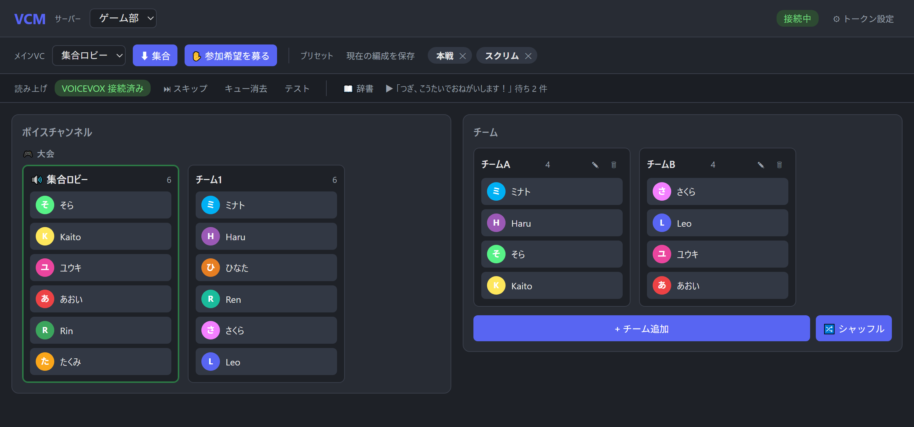

# VCM — VoiceChatMover v1.6.0

大会やイベントで、メインVC ⇄ チーム別VC の分散・集合をブラウザGUIから素早く行うための
Discord bot（ローカル起動・自分用）。



## できること

**VC編成**
- サーバー内のVC一覧・接続ユーザー（名前＆アイコン）・チームを**リアルタイム表示**
- メンバーカードを**ドラッグ＆ドロップ**（VC移動／チーム割当・1人1チーム）
- **ドラッグ範囲選択**: 余白から枠で囲んで複数人を一括選択→まとめて移動
  （Ctrl+ドラッグで追加選択、余白クリックで解除）
- チームヘッダをVC列へドラッグでチーム**一括移動**
- メインVC設定＋**集合・散開**（散開はチーム見出しをVCへドラッグしたとき記録される
  「散開先VC」へチーム単位で移動。散開先はVC一覧に ⛺ で表示）
- チーム編成の**プリセット保存／呼び出し**（散開先VCも一緒に保存）
- **🔀 シャッフル**: チーム所属メンバーをランダムかつ均等に振り分け直し。
  メンバーカードの **📌 ピン留め**で、リーダーなど動かしたくない人をチームに固定できる
- **参加希望の受付**: GUIの「✋ 参加希望を募る」でメインVCのチャットに参加希望ボタンを設置。
  メインVC接続中のユーザーがボタンを押すと本人だけに見えるチーム選択が表示され、
  選んだチームに所属（選択後または60秒放置でメッセージは自動的に消える）
- 複数サーバー対応（ヘッダのプルダウンで切替）

**読み上げ（VOICEVOX 検出時のみ有効）**
- **メインVC を設定すると bot が自動入室**（変更で移動・解除で退出）→ 入室VC の**内蔵チャット**を読み上げ
- `/voice` コマンドでユーザーごとの声設定（キャラ→スタイルの段階選択、tts.json に永続化）
- **辞書**（単語→読み、サーバーごと）、**スキップ／キュー消去**、テスト読み上げ（すべてGUI）
- VOICEVOX エンジンは自動検出・自動起動（未検出時は VC 編成機能のみ）

**その他**
- **ワンクリックアップデート**: 新しいバージョンが公開されるとGUIヘッダーに通知が表示され、
  クリック→「アップデートして再起動」で自動更新（設定は引き継がれる。配布版のみ）

## 使い方（配布版・推奨）

**Python のインストールも依存のインストールも不要です**（実行環境同梱）。

1. [Releases](https://github.com/Rupsilonomicron/VCM/releases) から `VCM_vX.X.X.zip` を
   ダウンロードして展開
2. Discord Bot を作成してサーバーに招待（下記）
3. `start_bot.bat` をダブルクリック → ブラウザが開くので Bot トークンを設定

詳しい手順・トラブルシューティングは zip 同梱の README を参照してください。

### Discord Bot の作成

1. https://discord.com/developers/applications → New Application → Bot
2. **Privileged Gateway Intents** で `SERVER MEMBERS INTENT` と `MESSAGE CONTENT INTENT` を ON
3. Bot Token をコピー（起動後のトークン設定画面で使用）
4. OAuth2 → URL Generator で `bot` + `applications.commands` スコープ、
   権限 `View Channels` `Send Messages` `Connect` `Speak` `Move Members` を付与し、サーバーに招待

### 設定

ポート・起動時サーバー・VOICEVOX の場所・Bot トークンは、ヘッダーの
**「⚙ 設定」** から変更できます（`config.json` を直接編集する必要はありません）。

以下は `config.json` を直接編集する場合のキー一覧（すべて省略可）。トークン設定時に
自動生成されます。

| キー | 内容 |
| --- | --- |
| `guild_id` | 起動時に選択するサーバー（省略時は最初のサーバー） |
| `host` / `port` | GUI の待受アドレス（省略時 127.0.0.1:8765）。**host は変更しないこと**（0.0.0.0 等にすると認証なしの全機能がネットワークに公開されます） |
| `voicevox_path` | VOICEVOX のインストール先が特殊な場合の手動指定 |
| `github_repo` | 更新確認先リポジトリの上書き（通常は変更不要） |

## ソースから起動（開発者向け）

配布版を使う場合は不要です。このリポジトリをcloneして動かす場合のみ:

```
py -m venv .venv
.venv\Scripts\python.exe -m pip install -r requirements.txt
start_bot.bat
```

## 制約（Discord 仕様）

- 移動できるのは**すでにVCに接続しているユーザーのみ**。VCにいない人は呼び出せません。
- bot に `Move Members` 権限と対象VCへの閲覧/接続権が必要です。

## 構成

```
VCM/
  vcm/
    main.py          エントリ（uvicorn 起動、トークンがあれば bot も起動）
    runner.py        bot のライフサイクル管理（トークン検証・起動・再起動）
    config.py        ローカル設定（config.json にトークンを保存）
    discord_bot.py   VC状態の取得と移動操作、読み上げのVC入退室、/voice コマンド
    voicevox.py      VOICEVOX エンジンの検出・自動起動・音声合成（FFmpeg 不要）
    tts.py           読み上げキュー・テキスト前処理・辞書/声設定の永続化（tts.json）
    update.py        GitHub Releases による更新確認
    server.py        FastAPI（WebSocket + REST、チーム状態を保持）
  web/
    index.html / app.js / style.css   ブラウザGUI
  dist_files/        配布物専用ファイルの原本（配布先向け README・同梱Python用 start_bot.bat）
  promo/             紹介用サムネイル・スクリーンショットの素材
  build_dist.bat     配布物ビルド（下記）
  build_dist.ps1     ビルドの実処理
  start_bot.bat      開発用起動（.venv の Python を使用）
  requirements.txt
  config.json        （初回のトークン設定時に自動生成・リポジトリ/配布物には含めない）
  presets.json       チーム編成プリセット（自動生成・同上）
  tts.json           読み上げの声設定・辞書（自動生成・同上）
```

## 配布物のビルドとリリース

ソース（vcm/ や web/）を修正したら `build_dist.bat` をダブルクリック。
`..\配布用\VCM` と `..\配布用\VCM_v{version}.zip` を最新のソースで作り直します。

- バージョンは `vcm/__init__.py` の `__version__` が唯一の定義元
  （README 見出し×2 と CHANGELOG も合わせて更新する）
- 埋め込み Python（3.12.10）は無ければ自動ダウンロード。依存は requirements.txt が
  変わったときだけ再インストール（`python\Lib\site-packages` へ同梱）
- `config.json` / `presets.json` / `tts.json` / `__pycache__` は配布物から自動除去
- 配布先向けの README と start_bot.bat は `dist_files/` の内容が使われる
  （配布物の文面を直したいときは `dist_files/` 側を編集）

リリース手順: バージョン更新 → ビルド → コミット＆タグ（`v1.2.0` 形式）を push →
GitHub の Releases でリリースを作成して zip を添付。リリースを公開すると
旧バージョンの利用者の GUI に更新通知が表示されます。
